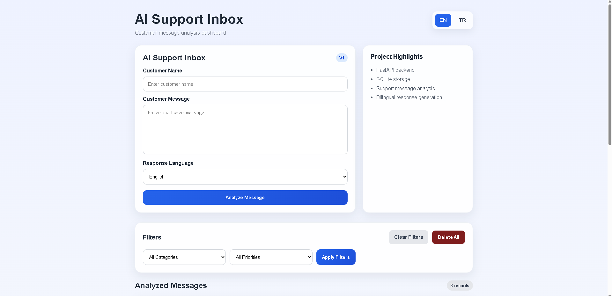
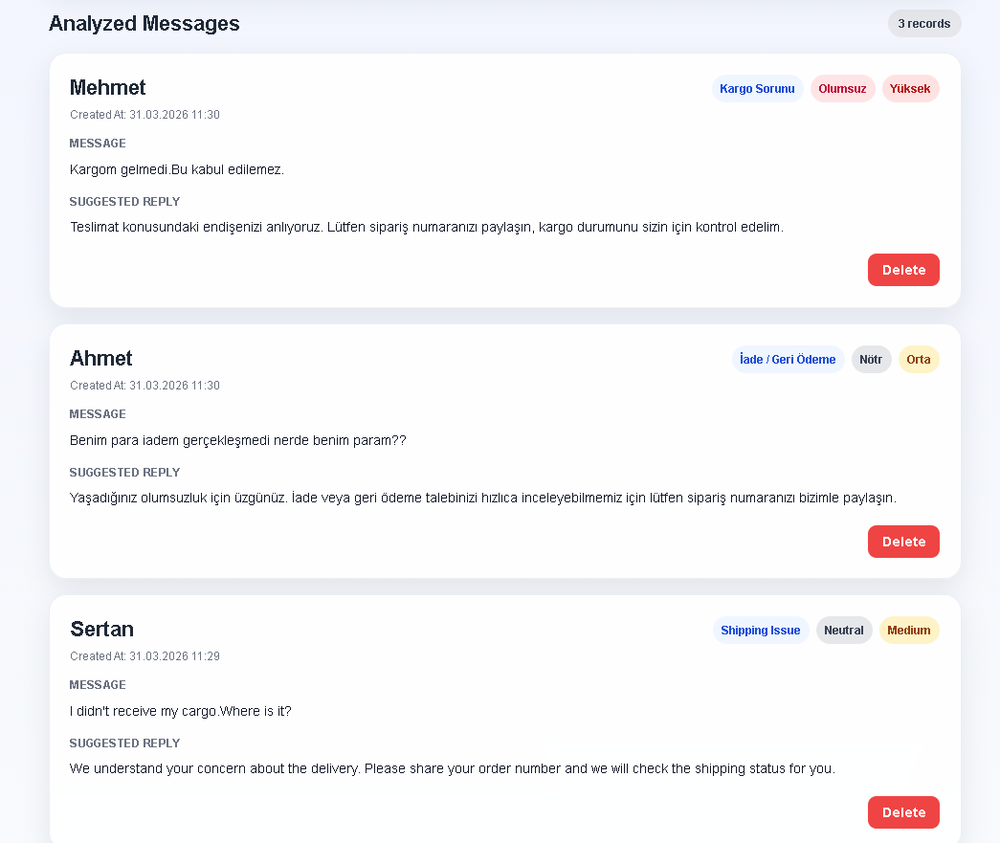

# AI Support Inbox

## Project Overview

AI Support Inbox is a **rule-based bilingual customer support inbox prototype** built with FastAPI, Jinja2, SQLAlchemy, and SQLite. It demonstrates a transparent workflow for receiving Turkish and English customer messages, assigning operational labels with predefined keyword rules, and suggesting a category-specific response template.

Despite the repository name, the current analysis engine does **not** use a large language model (LLM), machine learning model, or external AI API. Its outputs are deterministic and based on rules defined in the application code.

## Business Problem

Manually reviewing, categorizing, prioritizing, and drafting responses to customer messages can consume support teams' time and produce inconsistent results. A lightweight triage interface can make this workflow faster and more consistent while keeping every decision easy to inspect.

## Solution

The application provides a support dashboard that:

- accepts customer messages through a web form;
- supports Turkish and English interface text and response output;
- classifies messages using predefined keyword rules;
- assigns sentiment and priority labels using predefined rules;
- suggests a prepared response template based on the detected category; and
- stores submitted messages in a local SQLite database for review and filtering.

## How the Rule-Based Analysis Works

The selected response language is supplied by the user; the application does not detect language automatically. The message text is converted to lowercase and checked against predefined Turkish and English keyword lists.

1. **Category:** the first matching keyword group assigns one of five categories: General Inquiry, Refund / Return, Shipping Issue, Product Issue, or Pricing. Messages without a match remain General Inquiry.
2. **Sentiment and priority:** negative keywords produce a Negative / High combination, positive keywords produce Positive / Low, and messages without those matches remain Neutral / Medium.
3. **Suggested reply:** the application selects a fixed response template for the assigned category and requested response language.
4. **Persistence:** the original message and generated labels are stored as a SQLite record through SQLAlchemy.

These outputs are deterministic labels and templates. They are not model predictions, confidence scores, or advanced linguistic sentiment analysis.

## Key Features

- Customer message submission
- English and Turkish interface and response support
- Rule-based category detection
- Rule-based sentiment labeling
- Rule-based priority assignment
- Template-based response suggestions
- Category and priority filters
- SQLite persistence through SQLAlchemy
- Single-record deletion and delete-all functionality
- Server-rendered FastAPI and Jinja2 interface

## Technology Stack

- Python
- FastAPI
- Uvicorn
- SQLAlchemy
- SQLite
- Jinja2
- HTML and CSS

## Application Architecture

```text
Browser form
    |
    v
FastAPI routes (app/main.py)
    |-- rule-based analysis (app/ai_service.py)
    |-- SQLAlchemy models and session (app/models.py, app/database.py)
    |
    v
SQLite database + Jinja2-rendered dashboard
```

The application uses server-rendered HTML. Form submissions are handled by FastAPI routes, the analysis function returns deterministic labels and a response template, and SQLAlchemy persists the resulting record in SQLite.

## Data Model

Each `support_messages` record contains:

| Field | Purpose |
| --- | --- |
| `id` | Integer primary key |
| `customer_name` | Submitted customer name |
| `message` | Original customer message |
| `category` | Rule-assigned category label |
| `sentiment` | Rule-assigned sentiment label |
| `priority` | Rule-assigned priority label |
| `suggested_reply` | Category-specific response template |
| `created_at` | Record creation timestamp |

## Screenshots

### Message Submission and Filtering Dashboard

Users can submit customer messages, select the response language, and filter stored records by category and priority.



### Rule-Based Analysis Results

The dashboard displays the detected category, sentiment, priority, and template-based suggested response for Turkish and English messages.



## Installation and Run Instructions

Python 3.10 or later is recommended.

1. Clone the repository and enter the project directory.
2. Create and activate a virtual environment:

   ```bash
   python -m venv .venv
   ```

   Windows PowerShell:

   ```powershell
   .\.venv\Scripts\Activate.ps1
   ```

   macOS or Linux:

   ```bash
   source .venv/bin/activate
   ```

3. Install dependencies:

   ```bash
   python -m pip install -r requirements.txt
   ```

4. Start the development server from the repository root:

   ```bash
   python -m uvicorn app.main:app --reload
   ```

5. Open [http://127.0.0.1:8000](http://127.0.0.1:8000) in a browser.

The SQLite database is created locally as `support_inbox.db` when the application is imported or started. This runtime file is excluded from version control.

## Current Limitations

- No LLM, machine learning model, or external AI API integration
- No automatic language detection; the user selects the interface and response language
- No prediction confidence scores
- Keyword matching is substring-based and does not understand context, negation, or ambiguity
- Fixed categories, sentiment rules, priority rules, and response templates
- No authentication or role-based authorization
- No automated test suite
- No analytics dashboard or CSV export
- Local SQLite storage only; no production deployment configuration

## Future Improvements

- Add automated unit and integration tests for rules, routes, and persistence
- Introduce authentication and role-based access controls
- Add optional automatic language detection with a documented fallback
- Expand reporting with analytics and CSV export
- Make rules and response templates configurable outside the source code
- Add production-ready configuration, migrations, and deployment documentation
- Evaluate an LLM or machine learning integration only when the product requirements justify it, with clear disclosure and measurable validation

## Author

Developed by [Sertan Ayaş](https://github.com/sertanayas) as a portfolio prototype focused on backend development and transparent customer-support workflow automation.
